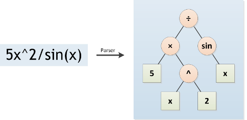
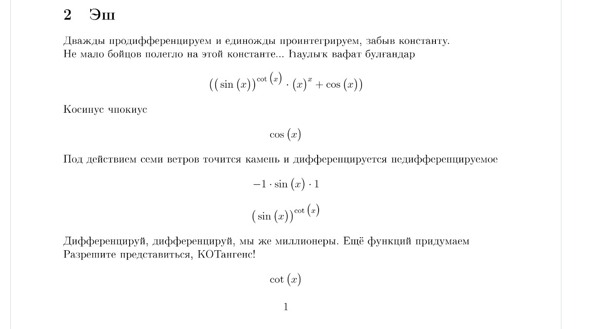

# Differentiator

## Project description

**Differentiator** --- the program that automatically takes a derivate and produces a LaTex report.

## Implementation

The first parser transform input expression into binary tree. Parser algorithm is based on recursive descent.

<p align = "center"></p>

Then we run a tree search to optimize our tree. It may be delete of useless statements such as ```0 + 10``` or replacing for a statements like ```0 * 10```.

```cpp
size_t Optimizer (Tree* mainTree, Node* currentNode) {

    if (mainTree == nullptr) {

        printf ("null pointer on mainTree in function %s!\n", __FUNCTION__);
        return 0;

    }

    if ( currentNode == nullptr )
        return 0;

    size_t changeCount = 0;

    changeCount += Optimizer (mainTree, currentNode->rightNode);
    changeCount += Optimizer (mainTree, currentNode->leftNode);

    if (MulOptimizer(mainTree, currentNode)) changeCount++;

    if (AddOptimizer(mainTree, currentNode)) changeCount++;

    return changeCount;

}
```

The last we call the differentiator itself which transform the source tree into new tree which shows differentiated function.

```cpp
Node* DifferentiateTree (Node* currentNode, FILE* writeInto) {

    CHECK_CURR_NODE

    switch (currentNode->type) {

        case CONST:
            return MakeConstNode (0, nullptr, nullptr);
        case VAR:
            return MakeConstNode(1, nullptr, nullptr);
        case FUNC:

            switch (currentNode->value.func) {

                case ADD:
                    return AddDiff (currentNode, writeInto);
                case SUB:
                    return SubDiff (currentNode, writeInto);
                case MUL:
                    return MulDiff (currentNode, writeInto);
                case DIV:
                    return DivDiff (currentNode, writeInto);
                case SIN:
                    return SinDiff (currentNode, writeInto);
                case COS:
                    return CosDiff (currentNode, writeInto);
                case TAN:
                    return TanDiff (currentNode, writeInto);
                case CTAN:
                    return CTanDiff (currentNode, writeInto);
                case DEG:
                    return DegDiff (currentNode, writeInto);
                case LN:
                    return LnDiff (currentNode, writeInto);
                default:
                    PRINT_ERROR(WrongFuncType, "unexpected func type of currentNode")
                    return nullptr;

            }

        default:
            PRINT_ERROR(WrongNodeType, "unexpected currentNode type")
            return nullptr;

    }

}
```

## Report generating

After we got differentiated function we call call a LaTex generator which shows step-by-step differentiating process. You may see the result in ```result.pdf``` file.

<p align = "center"></p>
